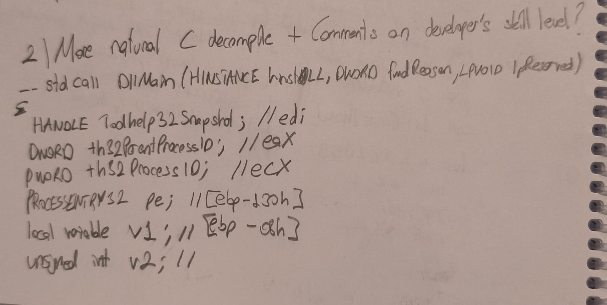
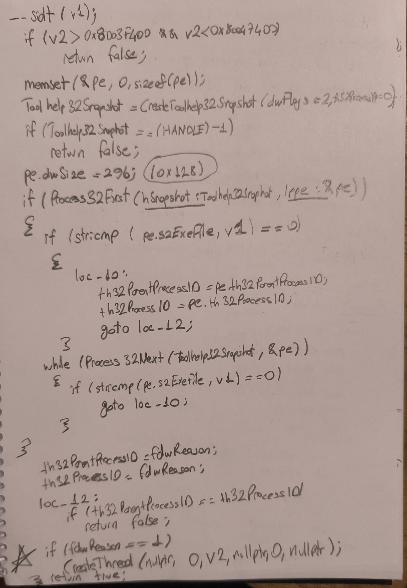
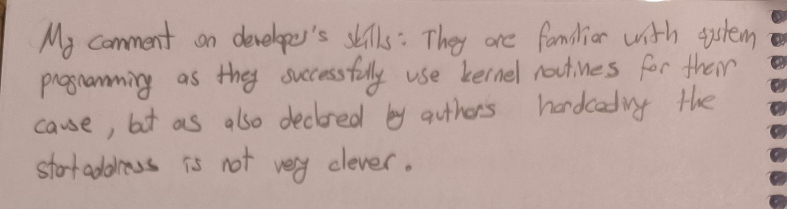

### Exercise 2: DllMain Natural C Decompile

This section contains the more natural and manual C decompilation of the `DllMain` function of Sample-J and an assessment of the developer's skill level.

#### Part 1: Local Variables

#### Part 2: Execution Flow

#### Part 3: Comments on Developer's Skill Level

**Assessment:**
The developers are familiar with system programming as they successfully use kernel routines for their cause, but as also declared by the authors, hardcoding the start address is not very clever.