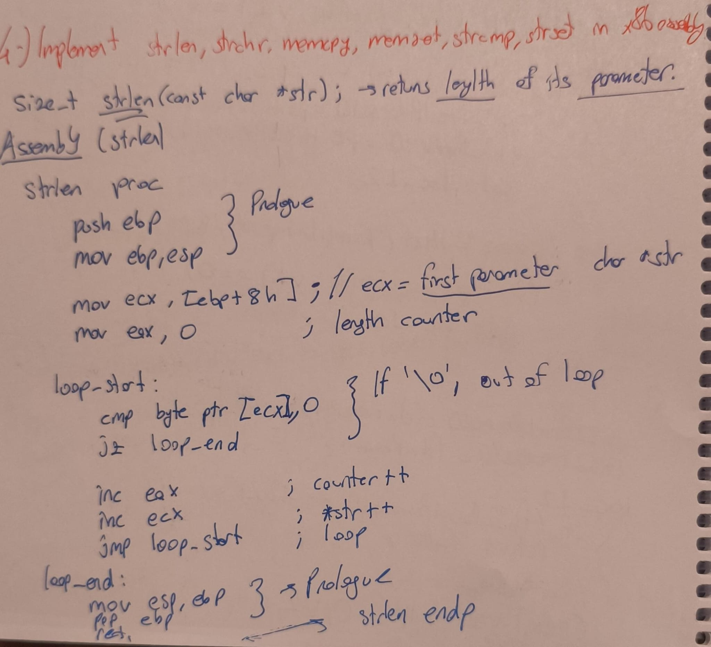
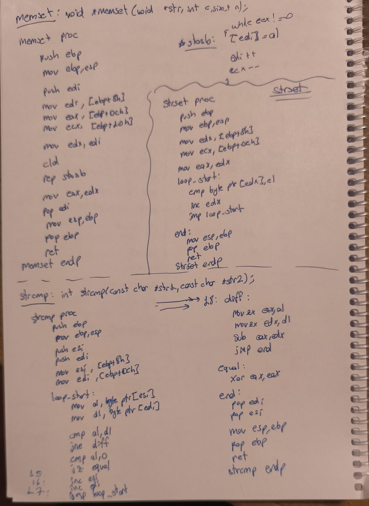
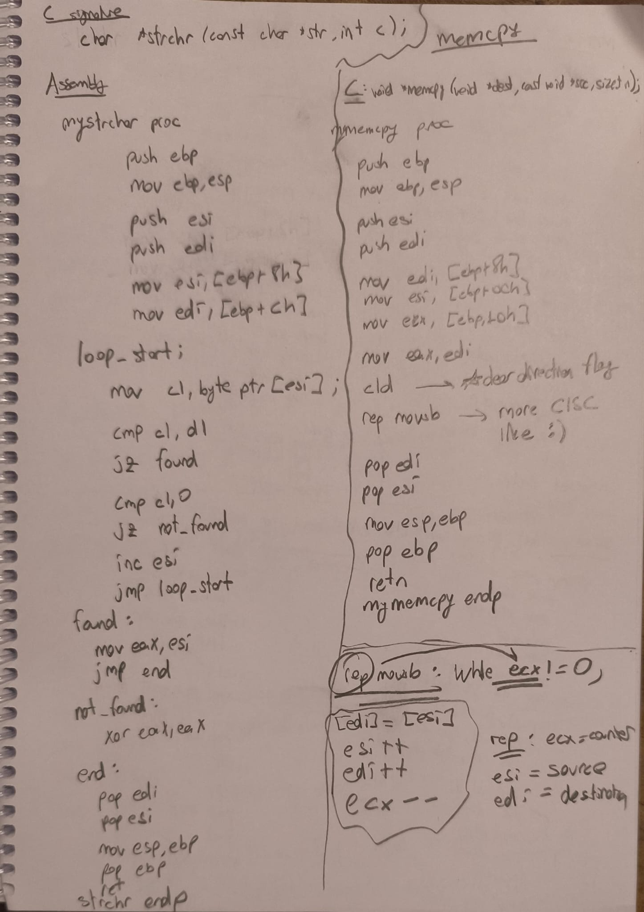

### Exercise 4: x86 Assembly Implementations for Some C functions

This section contains the x86 Assembly (handwritten) implementations  of some C functions

#### Part 1: strlen

#### Part 2: memset and strcmp

#### Part 3: strchr and memcpy

